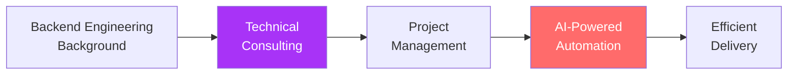
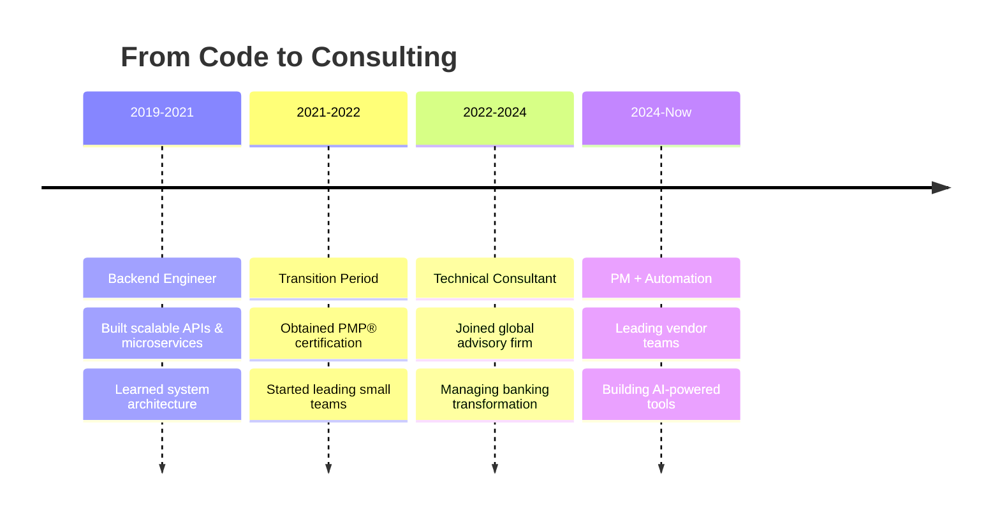

<div align="center">
  
</div>

<div align="center">
  
  <a href="https://linkedin.com/in/tzu-hui-wu-532109151" target="_blank">
    
  </a>
  <a href="https://medium.com/wuthmax" target="_blank">
    
  </a>
  <a href="mailto:wuthmax@gmail.com">
    
  </a>

  <br/><br/>

  <p>
    
    
    
  </p>

   

</div>

<br/>

## 👨‍💻 About Me

```typescript
const max = {
  role: "Technical Consultant @ Global Advisory Firm",
  title: "PMP® Certified Project Manager",
  location: "Taiwan 🇹🇼",
  currentMission: "Leading subsystem delivery in core banking transformation",

  careerJourney: {
    past: "Backend Engineer → Building scalable systems",
    present: "Technical PM → Managing vendors & go-live",
    approach: "Engineer's mindset meets PM discipline"
  },

  superpowers: [
    "🤖 AI-powered automation (Claude, ChatGPT, Cursor)",
    "🛠️ Building internal tools to streamline workflows",
    "🔗 Bridging technical teams & business stakeholders",
    "📊 Creating dashboards nobody asked for (but everyone uses)"
  ],

  philosophy: "If it's repetitive, automate it. If it's complex, simplify it.",
  funFact: "I code side projects at night to keep my engineering skills sharp 💻"
};
```

<div align="center">

### 🎯 My Unique Position


```mermaid
graph LR
    A[Backend Engineering<br/>Background] --> B[Technical<br/>Consulting]
    B --> C[Project<br/>Management]
    C --> D[AI-Powered<br/>Automation]
    D --> E[Efficient<br/>Delivery]
    style B fill:#A833F7,color:#fff
    style D fill:#ff6b6b,color:#fff
```

</div>

<details>
<summary><b>🎯 What I'm Currently Focused On</b></summary>
<br/>

- 🏦 **Day Job:** Managing vendor teams & coordinating subsystem go-live for Taiwan's largest core banking modernization
- 🤖 **Automation Obsession:** Building AI-powered tools to automate reporting, status tracking, and repetitive PM tasks
- 📊 **Dashboard Mania:** Creating Redmine/JIRA dashboards that transform chaos into clarity
- 📱 **Side Projects:** Launching **Bubly** (AI social assistant) and maintaining **Aura** to stay hands-on with modern tech
- ✍️ **Knowledge Sharing:** Writing about [AI-assisted project management](https://medium.com/wuthmax) on Medium
- 🌱 **Learning:** Exploring prompt engineering, workflow automation, and Go

</details>

<details>
<summary><b>💬 Ask Me About</b></summary>
<br/>

- 🎯 **Managing technical projects** in highly regulated industries (banking, finance)
- 🤖 **Using AI tools** (Claude, ChatGPT, Cursor) to automate PM workflows
- 🏗️ **Bridging the gap** between business stakeholders and engineering teams
- 📊 **Building dashboards** that actually get used (Redmine, Power BI, custom tools)
- 🔄 **Career transition** from Backend Engineer → Technical Consultant → PM
- 🚀 **Side project development** while maintaining a demanding full-time role

</details>

<details>
<summary><b>🛠️ Tools I Use Daily to Stay Productive</b></summary>
<br/>

**AI & Automation:**
- 🤖 **Claude / ChatGPT / Cursor** - Code generation, documentation, problem-solving
- 🔄 **Python Scripts** - Automating data extraction, report generation, status updates
- 📝 **Notion AI / Obsidian** - Knowledge management and meeting notes

**Project Management:**
- 📋 **JIRA / Redmine** - Issue tracking (with custom automation scripts)
- 📊 **Power BI / Looker** - Creating real-time project dashboards
- 🎨 **Miro / Figma** - Workshops and process mapping
- 📅 **MS Project** - Timeline and resource planning

**Development (Side Projects):**
- 💻 **VS Code + GitHub Copilot** - Fast prototyping
- 🔥 **Firebase / Supabase** - Quick backend setup
- 🚀 **Vercel / Netlify** - Instant deployments

</details>

---

## 🚀 Featured Projects

> **Why I Build:** These aren't just side projects — they're my way of staying technically sharp while solving real problems. Each one teaches me something new that I can apply to my consulting work.

<table>
<tr>
<td colspan="2" valign="top">

<div align="center">


# 🫧 Bubly
### Your AI Social Companion | Never Forget Who Matters

<p>
  <a href="https://apps.apple.com/app/bubly-social-assistant/id6754884488">
    
  </a>
  &nbsp;&nbsp;&nbsp;
  <a href="https://wutiger555.github.io/bubbo-s-world/" target="_blank">
    
  </a>
</p>

</div>

<br/>

<div align="center">
  
</div>

<br/>

> **"Bubly combines AI intelligence with thoughtful design to make relationship management effortless, natural, and meaningful."**

**🚀 Project Codename:** [OneMillion](https://github.com/lulalabana/OneMillion)

**Bubly** (internal codename: *OneMillion*) is my flagship application, now live on the App Store! It's not just a contact manager; it's an AI-powered assistant that helps you nurture every important connection in your life.

**✨ Key Features That Wow:**

| 🧠 **Know Your Bubbles**                                                              | ✍️ **Craft Perfect Wishes**                                      |
| :----------------------------------------------------------------------------------- | :-------------------------------------------------------------- |
| Never forget a hobby, milestone, or gift idea. Bubly tracks the details that matter. | Generate personalized messages in seconds—warm, fun, or formal. |

| 📅 **Never Miss a Moment**                                                                     | 🔒 **Privacy First**                                                       |
| :-------------------------------------------------------------------------------------------- | :------------------------------------------------------------------------ |
| Intelligent tracking of birthdays and anniversaries ensures you're always there to celebrate. | Your relationships are private. Bubly is built with security at its core. |

<br/>

**🔧 Enterprise-Grade Tech Stack:**
- **Core:** React Native (Expo) + TypeScript
- **AI Engine:** OpenAI / Claude Integration for personalized content
- **Backend:** Google Firebase (Auth, Firestore, Functions)
- **CI/CD:** GitHub Actions + EAS Integration for automated delivery

<div align="center">

[-181717?style=for-the-badge&logo=github)](https://github.com/lulalabana/OneMillion)
[](https://wutiger555.github.io/bubbo-s-world/)

</div>

<br/>

</td>
</tr>


<tr>
<td width="50%" valign="top">

<div align="center">

### 🌅 [Aura](https://github.com/wutiger555/Aura-Your-Ambiance-Share-APP)
**Synchronized Ambiance for Couples**

<br/>

<a href="https://github.com/wutiger555/Aura-Your-Ambiance-Share-APP">
  
</a>

<br/><br/>

**"Built for my long-distance relationship."**
<br/>
Real-time weather & emotion sync, blending time zones into one shared visual experience.

<br/>

</div>

**🔧 Tech Stack:**
- **Mobile:** React Native (Expo)
- **Web:** React + Tailwind CSS
- **Architecture:** Turborepo
- **Sync:** Real-time Location Services

<br/>

<div align="center">
  <a href="https://github.com/wutiger555/Aura-Your-Ambiance-Share-APP">
    
  </a>
</div>

</td>

<td width="50%" valign="top">

<div align="center">

### 📸 [Topicture](https://github.com/wutiger555/Topicture)
**Themed Photography Challenges**

<br/>

<a href="https://github.com/wutiger555/Topicture">
  
</a>

<br/><br/>

**"My first deep dive into iOS."**
<br/>
A daily mission-based photography app inspiring creativity and social sharing.

<br/>

</div>

**🔧 Tech Stack:**
- **Native:** Swift + SwiftUI
- **Cloud:** Firebase (Auth, Firestore)
- **Pattern:** MVVM Architecture
- **Features:** Core Location & Camera

<br/>

<div align="center">
  <a href="https://github.com/wutiger555/Topicture">
    
  </a>
</div>

</td>

</tr>
</table>

---

## 🛠️ Automation & Tools Showcase

<div align="center">

**Beyond apps, I build tools that make my (and my team's) work life easier**

</div>


<table>
<tr>
<td width="33%" align="center" valign="top">

### 📊 Dashboard Automator
<br/>


<br/><br/>
Automated dashboard pulling data from Redmine to generate weekly status reports. 
<br/>
**Impact: Saves ~3 hours/week**

</td>
<td width="33%" align="center" valign="top">

### 🔄 Meeting Notes AI
<br/>


<br/><br/>
AI-powered transcription & action item extraction. Auto-syncs to Notion.
<br/>
**Stack: Whisper + Claude API**

</td>
<td width="33%" align="center" valign="top">

### 📈 Vendor KPI Tracker
<br/>


<br/><br/>
Real-time vendor performance dashboard with automated alerting.
<br/>
**Stack: JIRA API + Power BI**

</td>
</tr>
</table>

## ⚡ Skills & Tech Stack

<table>
<tr>
<td valign="top" width="50%">

### 💼 Project Management & Consulting

```yaml
core_competencies:
  - Vendor & Stakeholder Management
  - Agile/Scrum (PMP® Certified)
  - Go-Live Coordination & Risk Mitigation
  - Technical Requirement Translation

industry_experience:
  - Core Banking Transformation
  - Financial Services & FinTech
  - Cross-functional Team Leadership

my_edge:
  - "Engineer brain + PM discipline"
  - "I speak both tech and business fluently"
  - "Automate everything that can be automated"
```

**PM Tools I Live In:**


**Certifications:**

🏅 **PMP® (Project Management Professional)**

</td>
<td valign="top" width="50%">

### 💻 Technical Skills (Still Sharp!)

**Languages I Code In:**


**Frameworks & Tools:**


**AI & Automation:**


**Cloud & DevOps:**


</td>
</tr>
</table>

---

## 📈 Career Journey

<div align="center">


```mermaid
timeline
    title From Code to Consulting
    2019-2021 : Backend Engineer : Built scalable APIs & microservices : Learned system architecture
    2021-2022 : Transition Period : Obtained PMP® certification : Started leading small teams
    2022-2024 : Technical Consultant : Joined global advisory firm : Managing banking transformation
    2024-Now : PM + Automation : Leading vendor teams : Building AI-powered tools
```

</div>

<table>
<tr>
<td width="33%" align="center">

### 🔧 Backend Engineer Era
**2019 - 2021**

Built RESTful APIs and microservices. Learned to write clean, scalable code. This foundation helps me review technical specs today.

</td>
<td width="33%" align="center">

### 🎯 Transition to PM
**2021 - 2022**

Obtained PMP® certification. Led small teams. Discovered I loved bridging tech & business.

</td>
<td width="33%" align="center">

### 🚀 Technical Consulting
**2022 - Present**

Managing subsystems in Taiwan's largest core banking project. Using AI to automate PM workflows.

</td>
</tr>
</table>

## 📊 GitHub Analytics

<div align="center">
  
  
</div>

<div align="center">
  
</div>

<div align="center">
  
</div>

<div align="center">
  
</div>

---

## ✍️ Writing & Knowledge Sharing

<div align="center">

### 📝 I write about what I learn

</div>

<table>
<tr>
<td width="50%">

**On Medium [@wuthmax](https://medium.com/wuthmax):**

- 🤖 AI-assisted project management workflows
- 🏦 Lessons from banking transformation projects
- 🔄 Career transitions: Engineering → Consulting → PM
- 🛠️ Building automation tools that actually work
- 💡 Bridging technical and business stakeholders

[](https://medium.com/wuthmax)

</td>
<td width="50%">

**Topics I'm Passionate About:**

```python
writing_topics = {
    "AI_Tools": ["Prompt engineering", "Workflow automation"],
    "PM_Life": ["Vendor management", "Go-live coordination"],
    "Career": ["Engineering to PM", "Staying technical"],
    "Side_Projects": ["Building with constraints", "Time management"]
}

# I write when I learn something worth sharing
for topic in writing_topics:
    if lesson_learned(topic):
        publish_article() 📝
```

</td>
</tr>
</table>

---

## 🤝 Let's Connect

<div align="center">

**I love connecting with people who are passionate about tech, PM, or building things.**

<p>
  <a href="https://linkedin.com/in/tzu-hui-wu-532109151">
    
  </a>
  <a href="https://medium.com/wuthmax">
    
  </a>
  <a href="mailto:wuthmax@gmail.com">
    
  </a>
</p>

</div>

<table>
<tr>
<td width="50%" valign="top">

### 💡 I'm Open To:

- ☕ **Coffee chats** about career transitions (Engineering → PM)
- 🤖 **Discussing AI tools** for project management automation
- 🚀 **Collaborating on open-source** tools for PMs
- 🎤 **Speaking engagements** on Agile, banking projects, or AI workflows
- 👥 **Mentorship** for engineers considering PM roles

</td>
<td width="50%" valign="top">

### 🎯 Let's Talk If You're:

- 🔄 **Transitioning** from engineering to PM/consulting
- 🤖 **Exploring AI tools** to streamline your workflows
- 🏦 **Working on** banking or FinTech transformations
- 📊 **Building** internal tools or automation scripts
- 💻 **Maintaining side projects** alongside a demanding job

</td>
</tr>
</table>

<div align="center">

### 📬 Best Way to Reach Me

**LinkedIn** for professional topics | **Medium** for thoughtful discussions | **Email** for everything else

*I usually respond within 24-48 hours. Promise!*

</div>

---

<div align="center">
  
</div>
